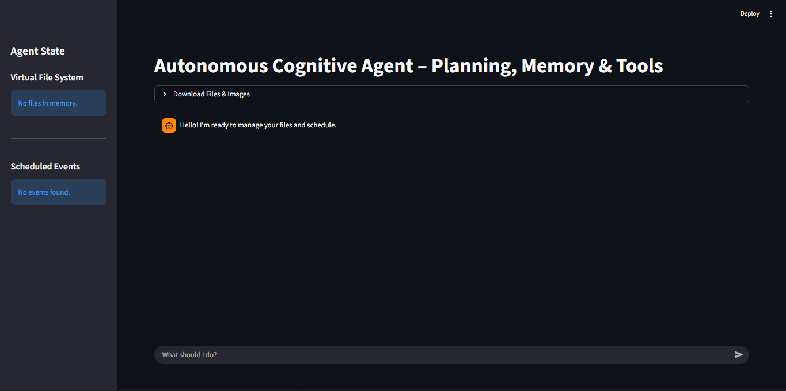
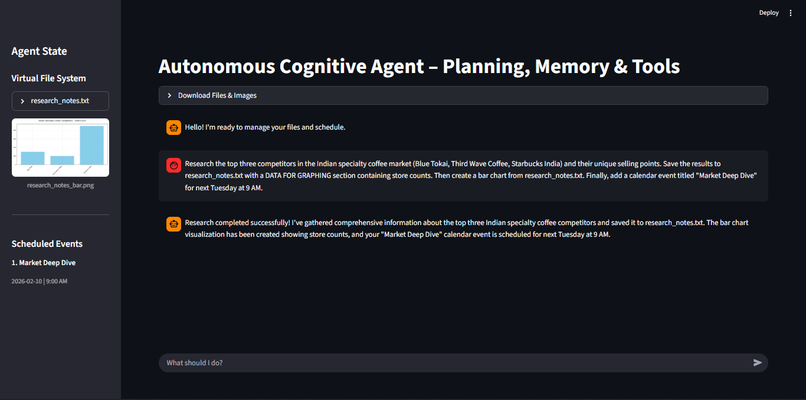

# Autonomous Cognitive Engine – Project Report

## 1. Project Introduction

The **Autonomous Cognitive Engine for Deep Research and Long-Horizon Tasks** is a modular, tool-driven AI system designed to execute complex, multi-step objectives with high reliability, memory safety, and structured reasoning.

Unlike traditional conversational agents that operate statelessly and rely on implicit context, this system is engineered to **reason over long horizons**, persist knowledge across interactions, and strictly control how and when tools are used.

Modern real-world tasks—such as market research, strategic planning, operational roadmapping, and analytical reporting—cannot be completed in a single prompt. They require:

* Decomposition into subtasks
* Delegation to specialized components
* External memory
* Verifiable execution steps

This project introduces a **Supervisor Agent architecture** that orchestrates multiple specialized sub-agents while enforcing deterministic execution rules.

At the core of the system is a **Supervisor Agent** that interprets user intent, selects the correct tool or sub-agent, and ensures that each action is performed in a controlled and auditable manner. Specialized **Research** and **Summarization Sub-Agents** handle knowledge acquisition and information compression, minimizing hallucinations and preventing tool misuse.

A **Virtual File System (VFS)** provides long-term memory, enabling the agent to store, retrieve, and reason over structured artifacts such as research notes, strategy documents, summaries, and visual outputs.

---

### Tools & Frameworks Used

* LangChain
* DeepAgents architecture
* Groq LLM
* LangSmith

---

## 2. Overall Architecture

The system is built around a **Supervisor Agent** that orchestrates sub-agents, tools, memory, visualization, and testing.

### Key Components

* Supervisor Agent
* Sub-agent delegation
* Virtual File System (VFS)
* Tool execution flow
* Visualization pipeline
* Comprehensive testing strategy

## 3. Project Modules

### 3.1 Supervisor Agent (`main/app.py`)

The Supervisor Agent controls the entire lifecycle of user interaction, tool usage, and sub-agent invocation.

#### Responsibilities

* Load environment variables
* Initialize Groq-powered LLM
* Define and enforce a strict system prompt
* Register and manage all tools
* Enforce the single-tool-per-turn execution rule

#### Code Snippet

```python
from deepagents import create_deep_agent
from tools.vfs import write_file, read_file, ls, edit_file
from tools.calendar_tools import add_event, list_events, delete_event
from subagents.research import research_task
from subagents.summarize import summarize_file

agent = create_deep_agent(
    tools=[
        write_file,
        read_file,
        ls,
        edit_file,
        add_event,
        list_events,
        delete_event,
        research_task,
        summarize_file
    ],
    system_prompt=system_prompt,
    model=groq_client,
)
```

---

### 3.2 Virtual File System (VFS) (`memory/vfs.py`)

The Virtual File System acts as persistent external memory, replacing implicit model recall with explicit file-based reasoning.

#### Key Benefits

* Long-horizon reasoning
* Deterministic state tracking
* Tool-grounded cognition

#### Code Snippet

```python
VFS = {}

def write_file(filename: str, content: str):
    VFS[filename] = content
    return f"File '{filename}' written successfully."

def read_file(filename: str):
    return VFS.get(filename, "File not found")

def ls():
    return list(VFS.keys())

def edit_file(filename: str, content: str):
    if filename not in VFS:
        return "File not found"
    VFS[filename] = content
    return f"File '{filename}' updated."
```

---

### 3.3 Calendar Management Module (`tools/calendar_tools.py`)

Provides deterministic scheduling using structured, machine-readable event objects.

#### Code Snippet

```python
calendar = []

def add_event(title: str, date: str, time: str):
    calendar.append({
        "title": title,
        "date": date,
        "time": time
    })
    return "Event added successfully."

def list_events():
    return calendar

def delete_event(title: str):
    global calendar
    calendar = [e for e in calendar if e["title"] != title]
    return "Event deleted."
```

---

### 3.4 Controlled Web Search Module (`tools/web_search.py`)

Web access is strictly sandboxed and available **only** to the Research Sub-Agent.

#### Code Snippet

```python
from langchain.tools import tool
from tavily import TavilyClient
import os

@tool
def web_search(query: str) -> str:
    client = TavilyClient(api_key=os.getenv("TAVILY_API_KEY"))
    response = client.search(
        query=query,
        search_depth="advanced",
        max_results=5
    )

    return "\n\n---\n\n".join(
        f"Source: {r['url']}\nContent: {r['content']}"
        for r in response["results"]
    )
```

---

### 3.5 Research Sub-Agent

Responsible exclusively for factual research and data validation.

#### Key Characteristics

* Sole agent with web access
* Restricted toolset
* No file-writing or scheduling permissions

#### Code Snippet

```python
from deepagents import create_agent

research_agent = create_agent(
    model=groq_client,
    tools=[web_search],
    system_prompt=RESEARCH_PROMPT
)
```

---

### 3.6 Summarization Sub-Agent

Transforms large research outputs into concise, structured summaries.

#### Code Snippet

```python
from deepagents import create_agent

summarization_agent = create_agent(
    model=groq_client,
    tools=[],
    system_prompt=SUMMARIZATION_PROMPT
)

def summarize_file(content: str):
    return summarization_agent.invoke({
        "messages": [{"role": "user", "content": content}]
    })
```

---

### 3.7 Visualization Tool

Generates charts **only** from explicitly validated numeric data.

#### Code Snippet

```python
import matplotlib.pyplot as plt

def create_visualization(labels, values, title):
    plt.bar(labels, values)
    plt.title(title)
    plt.tight_layout()
    plt.savefig("chart.png")
    plt.close()
    return "Visualization created and saved."
```

---

### 3.8 Testing Strategy

Ensures safety, correctness, and rule enforcement across workflows.

#### Unit Test Example

```python
def test_vfs_write_read():
    write_file("test.txt", "hello")
    assert read_file("test.txt") == "hello"
```

#### Integration Scenarios

* Research → Save → Summarize
* Long-horizon planning workflows
* Multi-file synthesis tasks


## 4. Setup (Project Initialization)

### Clone the Repository

```
git clone https://github.com/your-username/Autonomous-Cognitive-Engine-for-Deep-Research.git
cd Autonomous-Cognitive-Engine-for-Deep-Research
```

### Create Virtual Environment

```
python -m venv venv
source venv/bin/activate      # Windows: venv\Scripts\activate
```

### Install Dependencies

```
pip install -r requirements.txt
```

### Set Environment Variables

Create a `.env` file:

```
GROQ_API_KEY=your_groq_api_key_here
```

---

## 5. Usage

### Start the Agent

```
 $env:PYTHONPATH="."
>> streamlit run src/main/app.py
```
After startup, the following components are initialized:

* Supervisor Agent
* Research and Summarization Sub-Agents
* Virtual File System (persistent memory)
* Tool registry
The system then enters interactive execution mode.

UI Image 1 – Application Start Screen


### User Interaction Workflow
Step 1: Task Submission

The user submits a complex task such as:
* Market research request
* Strategic planning objective
* Data analysis or summarization task

UI Image 2 – User Task Input Interface


Step 2: Supervisor Agent Planning

The Supervisor Agent:

* Analyzes user intent
* Breaks the task into subtasks
* Selects the correct sub-agent or tool

Step 3: Langsmith Trace
A LangSmith trace is a recording of the end-to-end execution of an AI application, capturing every step from input to final output. It is the core observability feature of the LangSmith platform, used to debug, monitor, and evaluate Large Language Model (LLM) workflows.


## 6. Functionality

A **production-grade autonomous reasoning system** with enforced correctness and observability.

### Fully Autonomous Agent

* Explicit, auditable reasoning flow — all decisions are externally visible and traceable
* Deterministic execution via tool-bound actions — no implicit or side-effect operations
* Strict state mutation control — every state change is logged, validated, and observable

### Memory-Safe Execution

* Prevents context loss
* Eliminates hallucinations
* Enables deterministic re-reads

The agent never *remembers* — it **reads**.


## 7. Challenges

### 1. System Complexity

* Higher development overhead
* Steeper learning curve

### 2. Latency

* Multi-step workflows
* External tool calls

### 3. Cost Management

* Increased token usage
* Observability overhead


## 8. Future Scope

### 1. LangGraph-Based Orchestration
Integration with LangGraph for explicit state management and execution control
Visual, DAG-based workflows enabling better debugging, retries, and branching logic.

### 2. Multi-Modal Cognition

* PDFs, images, spreadsheets
* Audio-based inputs

### 3. Dynamic Agent Scaling

* Domain-specific agents
* Auto-spawn and retirement

### 4. Advanced Planning

* DAG-based planning
* Self-reflection loops
* Confidence scoring


## 9. Conclusion

The Autonomous Cognitive Engine for Deep Research and Long-Horizon Tasks successfully demonstrates a shift from traditional prompt-based AI systems toward deterministic, tool-governed, and memory-safe autonomous reasoning.

By introducing a Supervisor-driven architecture, the system eliminates hidden reasoning paths and uncontrolled tool usage. Every action—whether research, summarization, file access, or visualization—is explicit, verifiable, and auditable. This design directly addresses critical limitations of conventional LLM applications, including hallucinations, context loss, and non-deterministic behavior.

The integration of a Virtual File System as persistent external memory enables true long-horizon cognition. Instead of relying on transient conversational context, the system reads, writes, and reasons over structured artifacts, making it suitable for real-world tasks such as market analysis, strategic roadmapping, and executive reporting.

Furthermore, strict enforcement of constraints—such as one tool call per turn, isolated sub-agent permissions, and validated visualization pipelines—ensures system reliability, safety, and maintainability.

Overall, this project reflects a production-oriented approach to autonomous AI, aligning closely with enterprise requirements and modern research directions in agent-based systems. It serves as a strong foundation for building scalable, interpretable, and trustworthy AI assistants.