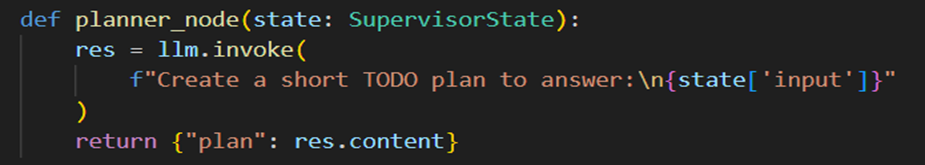
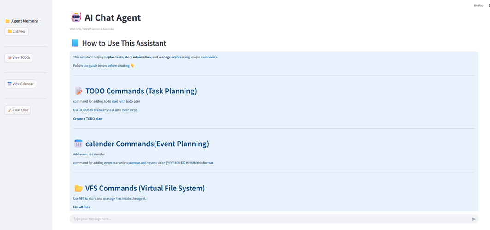
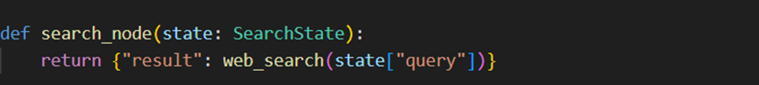
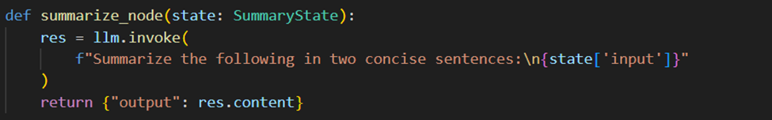

# Autonomous Cognitive Agent Project

## Project Overview
This documentation describes the design, architecture, and implementation of an Autonomous Cognitive Agent System built using Python, LangChain, LangGraph, and Groq-hosted Large Language Models (LLMs). The system demonstrates how modern LLM frameworks can be orchestrated into a scalable, modular, and stateful multi-agent architecture capable of autonomous reasoning, tool usage, and long-running task execution.
The project progresses incrementally—from a single LLM-powered agent to a fully coordinated multi-agent system with persistent memory and delegated responsibilities.

## System Objectives
The primary objectives of the project are:
*	To design an autonomous AI agent capable of reasoning and acting independently
*	To overcome LLM context limitations through persistent memory mechanisms
*	To demonstrate tool-enabled reasoning and execution separation
*	To implement a scalable multi-agent architecture with task delegation
*	To build a modular system that can be extended with additional agents and tools

## Technology Stack
* **Programming Language :**
*	Python – Core implementation language
*  **AI & Agent Frameworks :**
*	LangChain – LLM integration, prompt management, and tool abstractions
*	LangGraph – Stateful, graph-based agent execution and control flow
* **Large Language Models :**
*	Groq-hosted LLMs – High-performance inference used for reasoning, planning, summarization, and response synthesis
* **Storage and Memory :**
*	Virtual File System (VFS) – Persistent structured memory for long-term context retention
System Architecture Overview
The system follows a Supervisor–Worker multi-agent architecture. A central supervisor agent coordinates multiple specialized agents, each responsible for a distinct function. Shared memory ensures contextual continuity across all agents.
Key architectural principles include:
*	Separation of reasoning and execution
*	Tool-driven interaction with external memory
*	Modular agent design
*	Persistent state across sessions

## Initial Agent: AI To-Do List Agent
The AI To-Do List Agent serves as the foundational component of the system. It validates environment setup, LLM connectivity, and basic agent interaction patterns.
* **Role in System**
This agent provides the initial framework for user interaction and task management, allowing developers to test core functionalities such as input handling, reasoning processes, and memory usage. It acts as the starting point for understanding agent behaviors before adding complexity with additional agents.
* **Functionality**
*	Operates via a command-line interface
*	Accepts continuous user input
*	Uses an LLM to reason about task-related requests
*	Manages tasks in memory during runtime
* **Key Capabilities**
*	Prompt-driven reasoning using an LLM
*	Conversational interaction loop
*	In-memory task management
## Persistent Memory and Virtual File System (VFS)
* **Description**
The system uses a Virtual File System (VFS) to extend the memory of Large Language Models. It provides structured, persistent storage that agents can read and write, track tasks, and reference past decisions. Agents interact with the VFS through tools for reading, writing, updating, and listing memory entries, which helps maintain continuity and supports complex reasoning across multiple sessions
* **Design**
The VFS provides structured, persistent storage that is:
*	Loaded at runtime
*	Updated dynamically by agents
*	Accessible through well-defined tools
* **Tool Integration**
Custom tools are exposed to the LLM, allowing it to:
*	Read stored information
*	Write new data
*	Edit existing records
*	List available files or memory entries
The agent determines when tool usage is required, executes the operation, and resumes reasoning.

## Multi-Agent Architecture
* **Overview**
As task complexity increases, the system adopts a multi-agent design. Responsibilities are distributed among specialized agents coordinated by a supervisor.
This architecture improves:
•	Modularity
•	Scalability
•	Clarity of execution
•	Fault isolation
* **Role in System**
The multi-agent design allows parallel task handling and specialized processing. Each agent focuses on a specific domain, reducing bottlenecks and improving overall efficiency. It also provides a clear pathway to extend the system with new capabilities without disrupting existing agents.
## Supervisor Agent
The Supervisor Agent functions as the central controller and orchestrator of the system. It is the brain of the multi-agent system, making high-level decisions and ensuring all other agents work cohesively.
1.	Intent Interpretation: Transforms user intent into actionable tasks.
2.	Task Delegation: Generates execution plans and assigns tasks to specialized agents.
3.	State Management: Maintains the shared memory and produces a coherent final response
* **Responsibilities**
*	Interpret user intent and transform it into actionable tasks
*	Generate execution and delegation plans
*	Assign tasks to specialized agents based on their expertise
*	Maintain shared memory, conversation context, and system state
*	Integrate outputs from all agents and produce a coherent final response
*	Monitor agent performance and handle errors or task failures

* **Implementation :**
* **Supervisor Planning Node**
This node uses the LLM to convert unstructured user queries into a structured TODO plan. 
 
By converting unstructured user queries into a structured TODO plan, this function enables controlled execution and effective task delegation to downstream agents such as search and summarization
* **Response & Memory Node**
This function handles a single step of a conversation with an AI assistant. It takes the current user input, generates a reply using a language model, updates the conversation memory with both the user’s message and the AI’s response, and then returns the AI’s response. 
 
Essentially, it manages context, ensures the conversation history is stored, and produces a context-aware reply.

## Search Agent
The Search Agent is dedicated to gathering information from internal or external sources. It acts as the system’s knowledge retriever.
The search agent allows the system to dynamically acquire knowledge that the supervisor or other agents may require for reasoning or decision-making. By offloading information retrieval, it enables the supervisor to focus on planning and task integration. It ensures that decisions are data-driven and accurate.
* **Responsibilities**
*	Receive search queries from the supervisor
*	Locate relevant information from databases, files, or external APIs
*	Structure the retrieved data in a usable format for further reasoning
*	Return results promptly to the supervisor
* **Implementation:**
* **Search Node**
The search_node acts as the interface to the search system, using a SearchState to ensure type-safe data handling.

This function takes a state object containing a search query, performs a web search using that query, and returns the search results in a dictionary under the key "result".

## Summarizer Agent
The Summarizer Agent condenses large volumes of data into concise and meaningful summaries, acting as the system’s content simplifier. 
The summarizer agent enhances information clarity and usability. It reduces cognitive load on the supervisor and other agents by distilling complex or lengthy data into actionable insights. This ensures that the system can make efficient, informed decisions and provide user-friendly outputs.
* **Responsibilities**
*	Accept unstructured or verbose text input
*	Use LLMs to generate clear, concise summaries
*	Highlight critical points, trends, or key information
*	Deliver structured summaries to the supervisor or other agents
* **Implementation:**
This node distills a conversation turn into a brief, two-sentence summary for the workflow.

*	summarize_node is a workflow step in My Summarizer.
*	It takes input text and uses a language model to generate a concise summary.
*	The summary is limited to two sentences, keeping it brief and focused.
*	Outputs the summary in a structured format, making it easy to use in further workflow steps.

## Memory Integration Across Agents
All agents share access to the Virtual File System and conversation state. This shared memory model ensures:
*	Contextual continuity across interactions
*	Consistent reasoning across agents
*	Effective collaboration in long-running tasks
* **Role in System**
Memory integration allows the system to maintain coherent context and state across multiple agents, enabling sophisticat
