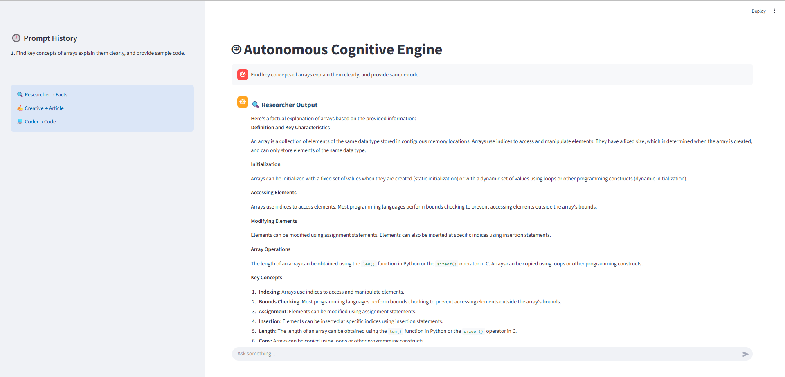

# **Autonomous Cognitive Engine – Project Report**
## **1. Introduction** 
The **Autonomous Cognitive Engine* is a modular, multi-agent AI system built using **Python, LangChain, Groq-hosted LLMs, LangSmith, and Streamlit**. The project demonstrates how a single application can coordinate multiple specialized agents—**Researcher, Creative, and Coder**—under a central **Orchestrator (Main Agent)** to solve complex user queries in a structured, observable, and explainable manner. Unlike traditional single-prompt chatbots, this system follows an **agent-based architecture** where each agent has a clearly defined responsibility and controlled access to tools. This separation improves reliability, reduces hallucinations, and makes the system easier to debug and extend.

-----------
## **2. Project Objectives**

The main objectives of this project are: 

 → Design a **multi-agent AI system** with clear role separation.

 → Enable **tool-based reasoning** instead of raw prompt-only generation.

 → Ensure **observability and traceability** using LangSmith.
 
 → Demonstrate **real-time interaction** through a Streamlit UI.
 
 → Build a modular codebase that can be easily extended with new agents or tools

-----------
## **3. Technology Stack** 
### Programming Language 
→  Python
### Frameworks & Libraries
 * **LangChain** – LLM abstraction and integration 
 * **langchain_groq** – Groq-hosted LLM integration
 * **LangSmith** – Tracing, observability, and debugging 
 * **Streamlit** – User interface 
 * **dotenv** – Environment variable management 
### Large Language Model 
* **Groq LLaMA 3.1 (8B Instant)**
-----------
## **4. System Architecture Overview** 
The system follows a **Supervisor–Worker (Orchestrator–Agent)** architecture.
 ### High-Level Flow
User → Main Agent (Orchestrator)
        → Task Planner Tool
        → Researcher Agent (Web Search)
        → Creative Agent (Article Generation)
        → Coder Agent (Code Generation)
        → Combined Response → Streamlit UI
        
The **Main Agent** acts as the supervisor coordinating execution and combining agent outputs into a single response.
-----------
## **5. Folder Structure**
```text
project_root/
├── agents/
│   ├── base_agent.py
│   ├── researcher.py
│   ├── creative.py
│   └── coder.py
├── tools/
│   ├── web_search.py
│   ├── code_generator.py
│   └── task_todo_planner.py
├── orchestrator.py
├── main.py
├── .env
├── requirements.txt
└── venv/
```
-----------
## **6. Core Components (Key Implementation)**

### 6.1 BaseAgent

The `BaseAgent` acts as the **foundation for all agents**. It initializes the shared Groq LLM and attaches commonly used tools. This avoids repeated LLM setup and enforces consistent configuration across agents.

**Responsibilities:**

* Initialize the Groq-hosted LLM (`ChatGroq`)
* Attach reusable tools (Web Search)
* Serve as the parent class for all agents

**Key Code:**

```python
from langchain_groq import ChatGroq
from tools.web_search import WebSearchTool

class BaseAgent:
    def __init__(self):
        self.llm = ChatGroq(
            model="llama-3.1-8b-instant",
            temperature=0
        )
        self.web_search = WebSearchTool()
```

---

### 6.2 Researcher Agent

The **Researcher Agent** is responsible only for **factual research and explanation**. It strictly avoids code generation to reduce hallucinations and maintain role clarity.

**Key Characteristics:**

* Uses the Web Search Tool
* Produces factual, structured explanations
* No code output

**Key Code:**

```python
from langsmith import traceable
from agents.base_agent import BaseAgent

class ResearcherAgent(BaseAgent):

    @traceable(name="Researcher Agent")
    def run(self, query: str) -> str:
        research = self.web_search.run(query)

        res = self.llm.invoke(
            f"Explain factually using this info:\n{research}\nDo NOT include any code."
        )

        return (
            "<h3 style='font-size:20px; font-weight:bold; color:#1f4e78;'>"
            "🔍 Researcher Output</h3>\n"
            f"{res.content}"
        )
```

---

### 6.3 Creative Agent

The **Creative Agent** transforms researched information into an **engaging, human-readable narrative** while preserving factual correctness.

**Key Characteristics:**

* Consumes research output
* Produces creative explanations or articles
* Does not generate code

**Key Code:**

```python
from langsmith import traceable
from agents.base_agent import BaseAgent

class CreativeAgent(BaseAgent):

    @traceable(name="Creative Agent")
    def run(self, query: str) -> str:
        research = self.web_search.run(query)

        res = self.llm.invoke(
            f"Write a creative, engaging article based on this info:\n"
            f"{research}\nDo NOT include any code."
        )

        return (
            "<h3 style='font-size:20px; font-weight:bold; color:#9c27b0;'>"
            "✍️ Creative Output</h3>\n"
            f"{res.content}"
        )
```

---

### 6.4 Coder Agent

The **Coder Agent** is exclusively responsible for **code generation and refinement**. It uses a dedicated tool to ensure clean separation from other agents.

**Key Characteristics:**

* Uses `CodeGenerationTool`
* Refines generated code using LLM
* Outputs formatted code blocks

**Key Code:**

```python
from langsmith import traceable
from agents.base_agent import BaseAgent
from tools.code_generator import CodeGenerationTool

class CoderAgent(BaseAgent):

    def __init__(self):
        super().__init__()
        self.code_gen = CodeGenerationTool()  # only here

    @traceable(name="Coder Agent")
    def run(self, query: str) -> str:
        code = self.code_gen.run(
            f"Write clean, optimized code for:\n{query}"
        )

        refined = self.llm.invoke(
            f"Refine and optimize this code:\n{code}"
        )

        return (
            "<h3 style='font-size:20px; font-weight:bold; color:#00796b;'>"
            "💻 Coder Output</h3>\n"
            f"<pre>{refined.content}</pre>"
        )
```

---

## **7. Tools Layer (Key Implementation)**

### 7.1 Web Search Tool

The Web Search Tool performs **controlled, structured research** by prompting the LLM to return facts with sources.

**Purpose:**

* Isolate research logic
* Provide structured factual data
* Improve traceability via LangSmith

**Key Code:**

```python
from langsmith import traceable
from langchain_groq import ChatGroq

class WebSearchTool:

    @traceable(name="Web Search Tool", run_type="tool")
    def run(self, query: str) -> str:
        llm = ChatGroq(model="llama-3.1-8b-instant", temperature=0)
        res = llm.invoke(
            f"""
Search IT-related sources and return structured info with sources.

Query: {query}

Include:
- Facts
- Sources (docs, blogs, papers)
"""
        )
        return res.content
```

---

### 7.2 Code Generation Tool

This tool encapsulates **all raw code generation**, ensuring that only the Coder Agent can produce executable code.

**Purpose:**

* Centralize code generation
* Improve debugging and observability
* Prevent code leakage into other agents

**Key Code:**

```python
from langsmith import traceable
from langchain_groq import ChatGroq

class CodeGenerationTool:
    def __init__(self):
        self.llm = ChatGroq(
            model="llama-3.1-8b-instant",
            temperature=0
        )

    @traceable(name="Code Generator Tool", run_type="tool")
    def run(self, prompt: str) -> str:
        return self.llm.invoke(prompt).content
```

---

### 7.3 Task To-Do Planner Tool

The Task To-Do Planner enforces **explicit step-by-step planning** before agent execution begins.

**Purpose:**

* Structured reasoning
* Deterministic execution flow
* Reduced agent ambiguity

**Key Code:**

```python
from langsmith import traceable
from langchain_groq import ChatGroq

class TaskToDoPlannerTool:

    @traceable(name="Central Task Planner", run_type="tool")
    def run(self, query: str) -> str:
        llm = ChatGroq(model="llama-3.1-8b-instant", temperature=0)
        return llm.invoke(
            f"Create a step-by-step execution plan for: {query}"
        ).content
```
----------
## **8.Setup**
### Step.1:Repository Setup
Download the project source code from GitHub and move into the project directory.
```bash
git clone https://github.com/your-username/Autonomous-Cognitive-Engine.git
cd Autonomous-Cognitive-Engine
```
### Step 2:Python Virtual Environment
Create an isolated Python environment to avoid dependency conflicts.
```bash
python -m venv venv
Activate the environment:
```bash
# Linux / macOS
source venv/bin/activate

# Windows
venv\Scripts\activate
```
### Step 3: Dependency Installation
Install all required Python packages listed in the project.
```bash
pip install -r requirements.txt
```
### Step 4:Configure Environment
Create a .env file in the root directory:
```bash
GROQ_API_KEY=your_groq_api_key_here
LANGSMITH_API_KEY=your_langsmith_api_key_here
LANGSMITH_TRACING=true
LANGSMITH_PROJECT=Autonomous-Cognitive-Engine
```
--------
## **9.Usage**
### launching the Streamlit ui
1. Navigate to the project root folder:

```bash
cd path/to/project_root
```

2. Run the Streamlit app:

```bash
streamlit run main.py
```

3. Open the URL provided in your terminal (typically `http://localhost:8501`).
### sample ui screenshot

----------
## **10. End-to-End Workflow**
1.User enters a query in the Streamlit UI

2.Main Agent invokes the Task Planner

3.Researcher Agent gathers factual data

4.Creative Agent generates an article

5.Coder Agent produces relevant code

6.Main Agent combines responses

7.Final output is displayed in the UI

8.Full execution is logged in LangSmith

---------
## **11. Future Scope**

-Integration with LangGraph for stateful workflows

-Persistent memory using a Virtual File System (VFS)

-Additional domain-specific agents

-Advanced planning with DAG-based execution

-Multi-modal inputs (PDFs, images, spreadsheets)

---------
## **12. Conclusion**

The Autonomous Cognitive Engine successfully demonstrates how a multi-agent, tool-driven AI system can be built using modern LLM frameworks. By combining structured planning, specialized agents, controlled tool usage, and full observability, the project moves beyond simple chatbots toward production-oriented autonomous AI systems.

This architecture provides a strong foundation for future research, scalability, and real-world AI applications.